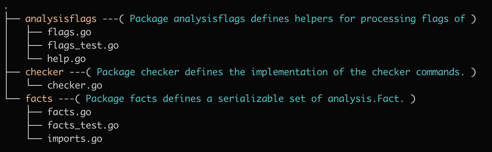

# gotree

 [](https://circleci.com/gh/po3rin/gotree) </a> [](https://golangci.com)



tree command to display go package document. This helps to understand the role of the package. hidden directory and File is not yet supported.

## Instalation

```
$ go get -u github.com/po3rin/gotree/cmd/gotree
```

## Usage

Specify the path as an argument.

```
$ gotree example
.
├── example1 ---( Package example1 for test. )
│   ├── a.go
│   ├── b.go
│   └── example11 ---( Package example11 for test. )
│       ├── a.go
│       ├── b.go
│       └── doc.go
├── example2
│   ├── a.txt
│   ├── b.txt
│   └── example21 ---( Package example21 for test. )
│       ├── a.go
│       ├── a_test.go
│       └── b.go
└── example3
    └── a.txt
```

Using ```--d``` flag, display directory only.

```
gotree --d example/
.
├── example1 ---( Package example1 for test. )
│   └── example11 ---( Package example11 for test. )
├── example2
│   └── example21 ---( Package example21 for test. )
└── example3
```

## Flags

```
Usage:
  gotree [flags]

Flags:
      --c         Display with color (default true)
      --d         Display directory only
  -h, --help      help for gotree
      --l int     Max display depth of the directory tree (default 10)
      --version   version for gotree
```
